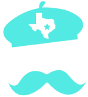
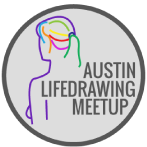
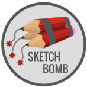
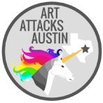

# Backyard Art
As an artist that loves what I do and wants to share, collaborate, and sell my art as well as be informed of what all art events and opportunities are occurring around me, I wanted to create a website for others like me. That's where Backyard Art comes in. It's a site made by art lovers, for art lovers. Built on “Keeping Austin Local”, everything is geared towards buying, selling, and sharing art from your own backyard. Every page is responsive, so no matter what size screen the user is viewing it on they will receive the same experience as they would on a desktop. Everything on the site was created through the use of HTML5, SCSS, and jQuery plugins.

## Problem
Living in a city that whose atmosphere is driven by a passion for music and the arts, you would think there would be an abundance of websites that are geared towards helping promote, sell, share, and inform its users of related events 
occurring in our beloved Austin, TX. When it comes to music, yes, but online resources are seriously lacking for artists. Austin is huge on keeping everything local, but unless you know how to set your search settings on Etsy to local or are an avid art festival goer, there currently isn't anything available to allow art enthusiasts and collectors to buy art from local artists in town. Want to know what art events are going on this week? Or perhaps you're an artist wanting to know the deadlines for all of the art festivals coming up. Either way, have fun googling for every event individually to know what's going on.

## Solution 
What I've created is a website application that allows Austin artists to showcase their art in order to sell to local art collectors/enthusiasts, as well as to  share, gain inspiration, and reach out to other local artists that are interested in collaborating or learning more. The web app also contains an all inclusive events calendar that consists of everything anyone would need to know when it comes to Austin's art exhibits, festivals, gallery openings, and social
events such as art meetups.

## Research

***S.W.O.T. ANALYSIS***  
   I broke down all of the strengths, weaknesses, opportunities, and threats that my site could potentially have. I really wanted to focus not only on current aspects of the site, but more importantly on future possibilities and features it could have if it were to continue beyond being just my final project.

***USER PERSONAS***  
   The user personas were created to help give me better sense of the target audience I was making my site for and the possible characteristics and interests that they would have. I really wanted to hone in on three main audiences: people interested in the site for buying art, artists that are recent Austin transplants and are wanting to get involved in the art community, and artists that are struggling to get their art seen and sold.

***USER INTERVIEWS***  
   When conducting user interviews, I focused my attention on both potential artist members and those who would be interested in buying artwork from the site. Through their responses I was able to optimize my page layouts and search options to better accommodate their needs. 

***WORDLIST***  
   I decided to create a word list as part of my research in order to assist in creating my design direction. Through compiling various relating words into categories (people, places, things, adjectives, and colors) I was able to group together like words to form potential design themes.

***CONTENT STRUCTURE***  
   The beginnings of my design research consisted of looking into what related websites are currently out there and how they went about sorting and displaying a lot of images/art. My findings were then implemented into how I designed the artist directory page and the individual artist's page.

***CALENDAR***  
   Another key component in my design research was finding a calendar tool to use on my event's page. Knowing that it was one of the main features on my site, it was crucial for it to allow a lot of content to be inputted, display that content in an aesthetically pleasing way, all the while have high functionality and run smoothly. I decided to go with UpTo for it's responsive design and easy usage and site maneuverability through being able to be embedded directly into my HTML code as an iframe. 

## The Design  
   For the initial design process, I drew up sketches of each page for small, medium, and large screen sizes and then I implemented them into wireframes using Adobe Illustrator. 

***THEME***  
   The design direction I decided to go in was derived from my "Pop" style guide. It's theme was centered around the idea of how the world is seen in black and white and art is the splash (or pop) of color that brings it to life. 

***COLOR SCHEME***  
   One of the challenges I faced when creating my color palette was that I wanted it to be reflective of my "pop of color vs. black and white" theme, yet not detract any attention from the most important elements on the page: the art. I decided on using only one color, a vibrant blue/turquoise that I pulled from the background image on the homepage, and used it sparingly on only the most important text or as an accent color in order to draw just enough attention.

***PAGE HEADERS AND HOME PAGE BACKGROUND IMAGES***  
   The homepage background images are from photographer Louis Lander-Deacon (known for the Imagine Dragons' _Head Me_ album cover). They were chosen not only for their beauty, but also for their relevance to the website name and the overall design theme for the site: 
* Through the use of animation I switched between black and white to colored versions of various photos from his collection to represent the "pop of color vs. black and white" theme.
* The photos are of art occurring outdoors like the name of the site infers: Backyard Art.
* The bright and vibrant colors in the photo are against an otherwise dull backdrop and therefore "pop". 

***TYPOGRAPHY***  
   Oswald Regular is a bold face sans-serif that was selected for the header/primary font due to it's modern appearance and eligibility on top of images when used in all uppercase. I paired it with Poppins (Light weight for body text, Medium weight for subheaders), another modern sans-serif whose more rounded edges contrast well against Oswald's more angular features. 

***ART CONTENT***  
   It was very important to me for the content on the site to stay genuine to my concept. All of the art featured on the artist directory page is from actual Austin artists who I'm friends with on Instagram and gave me permission to use their art as my examples. Ramona Flowers' page is a reflection of what an individual artist's page looks like after uploading their art and information onto the site. The art featured on that page is by my favorite artist, Steven Vigil, but since he doesn't live in Austin he agreed to letting me use a character from one of my favorite movies as the artist. Creating a clean and cohesive grid layout for his art images was difficult due to their difference in sizing. One of the most important things when it comes to displaying art with the intention of selling it is that you **do not** alter or crop the photos unless the artist does it or gives you permission to. Image optimization was another challenge I ran into because I wanted the site to have a fast loading time and low data usage for the user, but at the same time I didn't want to reduce the art's quality and details in the photos. I overcame this by adjusting their sizing and resolution in Adobe Photoshop.

***LOGO AND ICONS***  
   The part I enjoyed the most of our assignment was having to create 3-5 custom icons for our website using Adobe Illustrator. I decided to design a logo for my site, as well as icons for three reoccurring meetups on my events calendar.

The logo was created to symbolize the art factor through an artist's beret, and represent Austin by using a cut out of the shape of Texas and a mustache since facial hair is a very common feature amongst males living here.

  

For the Lifedrawing meetup I decided to reenact an actual life drawing by creating a simple sketch/outline of a female figure. With sketch bomb I took their name literally by using pencils as if they were TNT. Being that I attend the Art Attacks Austin meetup, I tried to encompass their fun and quirky audience through making a colorful warrior unicorn whose horn is "attacking" Austin.
